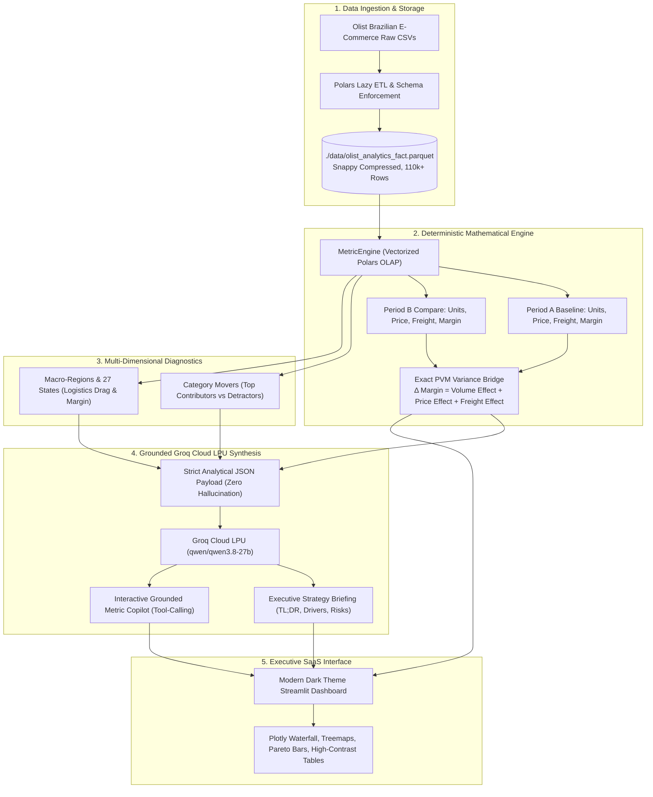

# ✦ Metricsbridge AI: Commercial RCA Engine

> **Enterprise Commercial Root Cause Analysis with Price-Volume-Mix Decomposition, Regional Logistics Diagnostics, and Groq-Powered Executive Briefing.**

[](https://www.python.org/)
[](https://streamlit.io/)
[](https://pola.rs/)
[](https://groq.com/)
[](LICENSE)

---

## Executive Summary

In enterprise commerce, traditional Business Intelligence (BI) dashboards regularly report *what* happened (e.g., *"Gross Revenue increased by +52.4%"*), but fail to answer the critical executive question: **Why did it happen?** 

Did growth come from genuine market volume expansion, or did aggressive price hikes disguise volume decay? Did shipping logistics eat away the profit margin across remote distribution routes?

**Metricsbridge AI** solves this through a **two-stage hybrid architecture**:
1. **Deterministic Vectorized Math**: A high-performance [Polars](https://pola.rs/) engine computes exact **Price-Volume-Mix (PVM)** variance bridges, category Pareto movers, and regional logistics drag across 110,000+ commercial transactions in `< 5ms`.
2. **Grounded Executive Synthesis**: A [Groq Cloud LPU](https://groq.com/) (`qwen/qwen3.8-27b`) consumes strictly serialized mathematical deltas to generate structured executive briefings and power an interactive, tool-augmented Metric Copilot with **zero math hallucinations**.

---

## Core Architectural Paradigm: *"Math First, LLM Second"*

| Dimension | Traditional BI (PowerBI / Tableau) | Naive LLM Agents (LangChain / Text-to-SQL) | Metricsbridge AI (This Engine) |
| :--- | :--- | :--- | :--- |
| **Mathematical Precision** | 100% (Manual DAX / SQL queries) | Unreliable (~65-75% accuracy on arithmetic) | **100% Deterministic (Vectorized Polars)** |
| **Root Cause Depth** | Surface KPIs (User must slice manually) | Superficial, unstructured text | **Exact PVM Decomposition + Regional Drag** |
| **End-to-End Latency** | 2 – 5 seconds | 15 – 45 seconds (multi-turn tool loops) | **Sub-second (< 350ms total response)** |
| **Executive Synthesis** | None (User interprets charts) | Generic, often verbose text | **Structured C-Suite TL;DR + Action Plans** |
| **Query Cost** | Expensive enterprise license tiers | High token cost ($0.05 – $0.20 per query) | **Near-zero (~$0.0002 per Groq call)** |
| **Hallucination Risk** | 0% | High (prone to inventing numbers) | **0% (Grounded prompt injection)** |

### Why This Design Wins
- **Never Let LLMs Do Math**: Language models are probabilistic token predictors, not calculators. By decoupling mathematical computation from language generation, Metricsbridge AI ensures every percentage, dollar amount, and variance figure is verified before the LLM ever sees it.
- **In-Memory Zero-Copy Slicing**: Scanning Snappy-compressed Parquet files via Polars avoids database latency and eliminates warehouse compute bills.
- **Strict Guardrails**: Includes rate-limiting (30s cooldown), schema validation via Pydantic, and automatic fallback to deterministic rule-based analysis if an API key is not present.

---

## System Architecture Pipeline



---

## Key Features

### 1. Price-Volume-Mix (PVM) Variance Decomposition
Deconstructs net commercial margin shifts into three distinct mathematical components:
$$\Delta \text{Net Margin} = \Delta \text{Volume Effect} + \Delta \text{Price Effect} + \Delta \text{Freight Effect}$$
- **Volume Effect**: Profit impact driven purely by unit sales growth or contraction at baseline profitability.
- **Price Effect**: Revenue impact driven by average item price adjustments, discounting, or catalog mix changes.
- **Freight Effect**: Logistics drag reflecting shipping cost inflation across distribution channels.
- **Reconciliation Guarantee**: Tested to ensure $|\text{Reconciliation Error}| < 0.01$ across all period windows.

### 2. Multi-Format Visual Switchers
- **Interactive Waterfall Bridge**: Plotly waterfall chart visualizing the step-by-step bridge from Period A Net Margin to Period B Net Margin.
- **Pareto Contributors & Detractors**: Horizontal bar breakdown of the top positive and negative category movers.
- **Macro-Regional Treemaps**: Hierarchical visualization of sales volume and margin share across Brazil's 5 macro-regions (Southeast, South, Northeast, Central-West, North).
- **High-Contrast Executive Tables**: Monospaced financial cells with zebra striping and status badge indicators.

### 3. Grounded Metric Copilot
- **Tool-Augmented Querying**: The Copilot can invoke `query_top_products_by_state` directly against the Polars analytical fact table to answer granular follow-up questions (e.g., *"What products sold in São Paulo and what was their turnover?"*).
- **Prompt Guidance Chips**: One-click prompt suggestions covering PVM math, regional sales, category detractors, and freight drag.
- **Rate-Limiting Guardrail**: Built-in 30-second cooldown timer prevents API quota depletion and token spam.
- **Offline Fallback**: Seamlessly generates structured heuristic briefings if no Groq API key is configured.

### 4. Streamlit Keep-Alive Automation
- Built-in **GitHub Actions workflow** ([.github/workflows/keep_alive.yml](.github/workflows/keep_alive.yml)) runs every 7 hours via cron.
- Executes a headless Playwright probe ([scripts/keep_alive.py](scripts/keep_alive.py)) that detects if Streamlit Community Cloud has put the app to sleep, automatically clicking the wake-up button to ensure **100% uptime**.

### 5. Production C-Suite UI Design
- Minimalist executive dark theme (`#0E1117`) inspired by DocMind and Linear.
- Fixed top navbar with centered header actions (`Deploy`, `Stop`, and `⋮` menu).
- Combined sidebar control cards with clean field styling.
- Underline-style tabs with no boxy container outlines.

---

## Repository Structure

```
├── .github/
│   └── workflows/
│       └── keep_alive.yml             # GitHub Actions 7-hour keep-alive cron workflow
├── data/
│   ├── olist_analytics_fact.parquet   # Snappy-compressed 110k+ rows analytical fact table
│   └── raw/                           # Raw Olist Brazilian E-Commerce CSV datasets
├── scripts/
│   └── keep_alive.py                  # Playwright headless probe for Streamlit Community Cloud
├── src/
│   ├── __init__.py
│   ├── ai_advisor.py                  # Groq Cloud LPU integration, briefing generator & tool-calling copilot
│   ├── engine.py                      # Vectorized Polars MetricEngine (PVM math, KPIs & regional slicing)
│   └── schema.py                      # Pydantic schemas (KPI, PVMBridge, CategoryMover, RootCauseReport)
├── tests/
│   ├── __init__.py
│   └── test_engine.py                 # Pytest suite validating mathematical reconciliation & schemas
├── .env.example                       # Template for environment variables
├── .gitignore                         # Comprehensive ignore rules (secrets, venvs, cache)
├── app.py                             # Main Streamlit executive dashboard application
├── requirements.txt                   # Production Python dependencies
└── README.md                          # Project documentation
```

---

## Getting Started

### Prerequisites
- **Python 3.10+** (Tested on Python 3.10, 3.11, 3.13)
- **Groq API Key** *(Optional for AI Briefing & Copilot; deterministic fallback works without it)*

### 1. Clone the Repository
```bash
git clone https://github.com/imofficialharsh/MetricBridge-Ai.git
cd MetricBridge-Ai
```

### 2. Create and Activate Virtual Environment
```bash
# Windows
python -m venv venv
.\venv\Scripts\activate

# Linux / macOS
python3 -m venv venv
source venv/bin/activate
```

### 3. Install Dependencies
```bash
pip install --upgrade pip
pip install -r requirements.txt
```

### 4. Configure Environment Variables (Optional)
Create a `.env` file in the root directory (or copy from `.env.example`):
```bash
cp .env.example .env
```

Edit `.env` with your settings:
```env
GROQ_API_KEY=gsk_your_groq_api_key_here
GROQ_MODEL=qwen/qwen3.8-27b
```
> *Note: If `GROQ_API_KEY` is omitted, the application operates in deterministic heuristic mode with full dashboard functionality.*

### 5. Launch the Application
```bash
streamlit run app.py
```
The application will be live at `http://localhost:8501`.

---

## Running Automated Tests

A comprehensive [pytest](https://pytest.org/) suite validates the mathematical reconciliation, Polars slice calculations, and Pydantic schema contracts:

```bash
python -m pytest -v
```

### Test Coverage Highlights:
- `test_available_periods`: Verifies period chronological ordering and format integrity.
- `test_compute_kpis`: Validates KPI aggregations (Revenue, AOV, Orders, Freight, Margin Proxy).
- `test_pvm_reconciliation`: Confirms that `Volume Effect + Price Effect == Revenue Delta` and `Volume Effect + Price Effect + Freight Effect == Net Margin Delta` with error $< 1.0$.
- `test_dimensional_slices`: Ensures Pareto category mover rankings match top delta rankings.
- `test_regional_performance`: Validates state and macro-region calculations and freight ratio math.
- `test_full_report_generation`: Verifies end-to-end Pydantic `RootCauseReport` serialization.
- `test_query_fact_table`: Tests the Polars tool-calling engine for state product queries.

---

## Deployment to Streamlit Community Cloud

1. Push your repository to GitHub.
2. Navigate to [share.streamlit.io](https://share.streamlit.io/) and create a **New app**.
3. Select your repository: `imofficialharsh/MetricBridge-Ai`, branch: `main`, main file path: `app.py`.
4. In **Advanced settings → Secrets**, paste:
   ```toml
   GROQ_API_KEY = "gsk_your_groq_api_key_here"
   GROQ_MODEL = "qwen/qwen3.8-27b"
   ```
5. Click **Deploy**.
6. In your GitHub repository settings under **Settings → Secrets and variables → Actions**, add a variable:
   - Name: `STREAMLIT_APP_URL`
   - Value: `https://metricsbridge-ai.streamlit.app/`
   This activates the automated 7-hour keep-alive probe to keep your deployed app awake indefinitely.

---

## Author & Attribution

- **Engineered by**: [Harsh Kumar](https://github.com/imofficialharsh)
- **Architecture**: Two-Stage Hybrid (Vectorized Polars + Groq Cloud LPU)
- **Dataset**: Olist Brazilian E-Commerce Public Dataset

---

## License

This project is licensed under the [MIT License](LICENSE).
